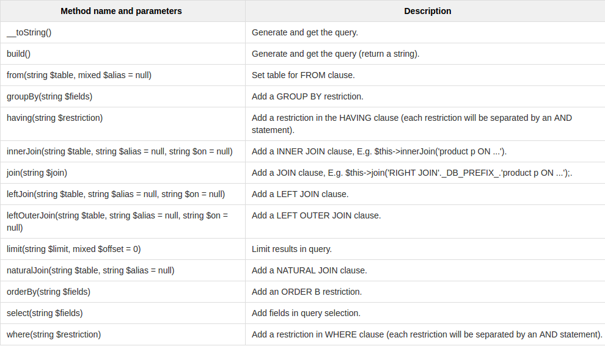
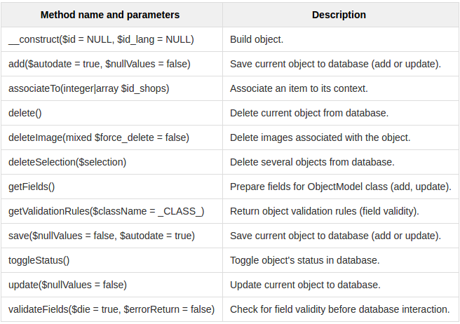

# Acceso a la base de datos

## Nomenclatura

* Las tablas empiezan por _ps\__
* Las tablas que relacionan dos entidades las muestran en su nombre como por ejemplo _ps\_category\_product_
* Las tablas que contienen el sufijo _\_lang_ contienen traducciones
* Las tablas que contienen registros que enlacen a una tienda específica deben terminar en _\_shop_

## La clase DBQuery

Es un constructor que te ayuda a crear consultas SQL:

```php
$sql = new DbQuery();
$sql->select('*');
$sql->from('cms', 'c');
$sql->innerJoin('cms_lang', 'l', 'c.id_cms = l.id_cms AND l.id_lang = '.(int)$id_lang);
$sql->where('c.active = 1');
$sql->orderBy('position');
return Db::getInstance()->executeS($sql);
```



## La clase ObjectModel

Para afinar más, tenemos que usar esta clase. Es el objeto principal del modelo de objetos de PS y puede ser sobrescrito pero con precaución.

Los atributos de tabla o vista de la base de datos de PS se encapsulan en esta clase, así que está vinculada a un registro de base de datos. Después de que el objeto ha sido instanciado, se añade un registro a la base de datos. Cada objeto recupera sus datos de la base de datos; cuando un objeto se actualiza, el registro se actualiza también. La clase implementa accesos por cada atributo.

### Definir el modelo

Debes usar la variable estática _$definition_ para definir el modelo:

```php
/**
* Example from the CMS model (CMSCore)
*/
public static $definition = array(
  'table' => 'cms',
  'primary' => 'id_cms',
  'multilang' => true,
  'fields' => array(
    'id_cms_category'  => array('type' => self::TYPE_INT, 'validate' => 'isUnsignedInt'),
    'position'         => array('type' => self::TYPE_INT),
    'active'           => array('type' => self::TYPE_BOOL),

    // Language fields
    'meta_description' =>
        array('type' => self::TYPE_STRING, 'lang' => true, 'validate' => 'isGenericName', 'size' => 255),
    'meta_keywords'    =>
        array('type' => self::TYPE_STRING, 'lang' => true, 'validate' => 'isGenericName', 'size' => 255),
    'meta_title'       =>
        array('type' => self::TYPE_STRING, 'lang' => true, 'validate' => 'isGenericName', 'required' => true, 'size' => 128),
    'link_rewrite'     =>
        array('type' => self::TYPE_STRING, 'lang' => true, 'validate' => 'isLinkRewrite', 'required' => true, 'size' => 128),
    'content'          =>
        array('type' => self::TYPE_HTML,   'lang' => true, 'validate' => 'isString', 'size' => 3999999999999),
  ),
);
```

### Un modelo para varias tiendas e idiomas

Para recuperar un objeto en varios idiomas:

```php
'multilang' => true
```

Para recuperar un objeto que depende de la tienda actual:

```php
'multishop' => true
```

Para recuperar un objeto que dependa de la tienda actual y en varios idiomas:

```php
'multilang_shop' => true
```

### Los métodos principales

Cualquier sobreescritura de los métodos del ObjectModel influirá en como las demás clases y métodos actuarán. Úsalo con cuidado:



