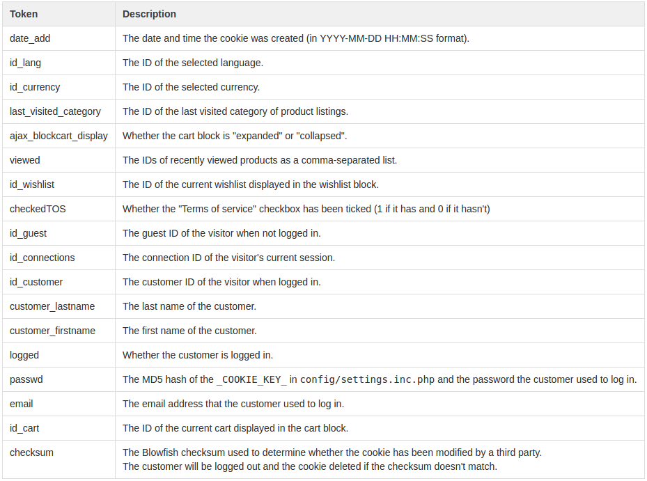
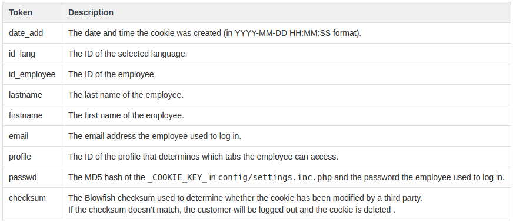

# Administrar cookies

PS utiliza cookies encriptadas para almacenar toda la información de sesión, tanto para visitantes/clientes como para empleados/administradores.

La clase Cookie \(`/classes/Cookie.php`\) se utiliza para leer y escribir cookies.

Para acceder a una se puede usar

```php
$this->context->cookie;
```

Toda la información almacenada dentro de una cookie está disponible usando este código:

```php
$this->context->cookie->variable;
```

Si necesitas acceder a una cookie de PS desde un código que no sea PS, puedes usar el siguiente código:

```php
include_once('path_to_prestashop/config/config.inc.php');
include_once('path_to_prestashop/config/settings.inc.php');
include_once('path_to_prestashop/classes/Cookie.php');
$cookie = new Cookie('ps'); // Use "psAdmin" to read an employee's cookie.
```

## Datos en una cookie de cliente o visitante



## Datos en una cookie de empleado o administrador



