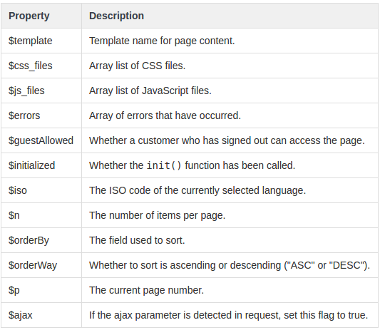

# Controladores

Todos los controladores de PS en realidad sobreescriben la clase _Controller_ a través de otra clase que la hereda:

* AdminController
* ModuleAdminController
* FrontController
* ModuleFrontController

Puedes encontrarlas en la carpeta `/classes/controller`

## La clase FrontController

Algunas de sus propiedades:

### Orden de ejecución de las funciones del controlador

1. _\_\_contruct\(\)_: Define todas las variables del controlador miembro.
2. _init\(\)_: Inicializa el controlador
3. _setMedia\(\)_ o _setMobileMedia\(\)_: Añade todos los JavaScript y CSS específicos para la página para que puedan ser combinados, comprimidos y cacheados \(ver PrestaShop's CCC tool, en el the back office en la página de "Rendimiento", bajo el menú de "Preferencias avanzadas"\).
4. _postProcess\(\)_: Maneja los procesos Ajax.
5. _initHeader\(\)_: Llamado antes de initContent\(\).
6. _initContent\(\)_: Inicializa el contenido.
7. _initFooter\(\)_: Llamado después de initContent\(\).
8. _display\(\)_ o _displayAjax\(\)_: Muestra el contenido.

### Controladores existentes del Front Office

Hay un montón y se pueden consultar [aquí](http://doc.prestashop.com/display/PS16/Controllers+within+PrestaShop).

### Sobrescribir un controlador

Gracias a la herencia, puedes cambiar el comportamiento de un controlador o añadir nuevos. Estas sobrescrituras deben utilizarse únicamente para necesidades específicas de una tienda, nunca ser distribuidos porque si no otros módulos no serán capaces de utilizarlos.

Los controladores se almacenan en `/controllers` y utilizan el sufijo _Core_. Por ejemplo, el controlador de categoría:

* File `/controllers/CategoryController.php`
* Class _CategoryControllerCore_

Para sobrescribir un controlador, primero debes crear una nueva clase sin el sufijo _Core_ y colocarlo en `/override/controllers`. Por ejemplo, para sobrescribir el controlador:

* File `/override/controllers/front/CategoryController.php`
* Class _CategoryController_

