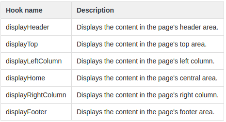

# Registrando Hooks

## Que son

Son un modo de asociar tu código a eventos específicos de PS.  
Muchas veces, se usan para insertar código dentro de una página.  
Por ejemplo, la página inicial del theme por defecto tiene los siguientes hooks:



## Tipos de hooks

### Comienzan por 'display'

Para agregar código HTML o JS en determinados lugares.

### De acción

Cambiaremos el comportamiento al realizar acciones, por ejemplo mandar un mail al actualizar un producto o que pase algo cuando se agrega algo al carrito.

## Zona de administración

Se pueden asignar módulos a hooks en:

```text
Mejoras -> Diseño -> Posiciones de los módulos
```

Aquí vemos las posiciones en las que están insertados cada uno de los módulos. Si hacemos clic en **Insertar un módulo** podremos seleccionar un módulo y moverlo a un hook, aunque ahora mismo en nuestro nuevo módulo no podremos moverlo a ninguno: tendremos que decirle mediante código a cuales podrá.

## Adjuntar módulos a hooks

En la instalación del módulo tenemos que decirle a que hooks podrá adjuntarse.

```php
public function install() {
    if (!parent::install() ||
        !Configuration::updateValue('CWEJEMPLO_URL','http://example.com') ||
        !$this->registerHook('displayProductAdditionalInfo'))
        return false;
    return true;
}
```

En este ejemplo le decimos que nuestro módulo puede aparecer en el hook **displayProductAdditionalInfo**.

### Devolver lo que mostrará el hook

Tenemos que crear un método en la clase que tendrá la sintaxis: la palabra **hook** y después el nombre del hook con la primera letra en mayúsculas. Al ser un hook de display debe devolver un valor que es lo que se va a mostrar. Este método recibe un \(y solo uno\) argumento: un array de la información contextual enviada al hook.:

```php
public function hookDisplayProductAdditionalInfo($params) {
    return 'Soy el nuevo módulo';
}
```

Hecho esto hay que **reinstalarlo**, para lo que nos servirá la opción **reset** del módulo en el backoffice. Directamente lo veremos en la página de producto.

En la **zona de administración** veremos ya nuestro módulo en el hook correspondiente y tendremos la posibilidad de ordenar la posición de nuestro módulo respecto a otros que existan. Desde esta zona podremos también desenganchar el módulo del hook para evitar que aparezca.

Ahora en la página de **insertar un módulo** sí podremos volver a insertar el nuestro en una de las posiciones en las que las hayamos registrado, e incluso más abajo determinar en qué páginas no queremos que aparezca el módulo en la sección **excepciones**.

### Colocar un módulo en un hook a través de base de datos

Si no quieres reinstalar un módulo, pero quieres que se muestre en un hook que no te aparece en la administración, lo que debes hacer es insertar un registro en la tabla de la base de datos **ps\_hook\_module**, indicando:

1. identificador del módulo \(ver en ps\_module\)
2. identificador de la tienda \(ver en ps\_shop\)
3. identificador del hook \(ver en ps\_hook\)
4. posición relativa al resto de módulos, para realizar la ordenación

## Incluir un hook en una plantilla smarty

Para incluir un hook dentro de una plantilla smarty se hace con el siguiente código \(product es opcional, es solo un parámetro pasado al hook\):

```php
<div class="product-additional-info">
    {hook h='displayProductAdditionalInfo' product=$product}
</div>
```

Si no especificamos el módulo, pintará todos los módulos en orden, en función de la posición de los mismos. Si queremos que solo pinte el hook especificado de un módulo concreto, puedes añadir el nombre del módulo que quieres que ejecute el hook:

```php
{hook h='displayLeftColumn' mod='blockcart'}
```

### Incluirlo desde FrontController

Otro modo un poco más engorroso es añadir una variable contextual a smarty. Para ello debemos añadir nuestro hook al **FrontController.php** de la clase sobrescrita:



```php
<?php
class FrontController extends FrontControllerCore
{
    public function initContent()
    {
        parent::initContent();
            
        $this->context->smarty->assign(array(
            'HOOK_TOP_LEFT'            => Hook::exec('displayTopLeft'),
            ...
            'HOOK_DISPLAY_DEVEP' => Hook::exec('displayDevepShop'),
        ));
    }
}
```



Con esto, en nuestra plantilla smarty podemos mostrarlo así:



```php
{if isset($HOOK_DISPLAY_DEVEP)}
	{$HOOK_DISPLAY_DEVEP}
{/if}
```



### Otro modo

Desde la plantilla podemos:



```php
{capture name='displayDevepShop'}{hook h='displayDevepShop'}{/capture}
{if $smarty.capture.displayDevepShop}
    {$smarty.capture.displayDevepShop}
{/if}
```



## Llamar a un hook desde un controlador

Es fácil llamar a un hook desde un controlador: simplemente tienes que usar su nombre con el método _hookExec\(\)_. Por ejemplo:

```php
Module::hookExec('NombreDelHook');
$this->context->smarty->assign('HOOK_LEFT_COLUMN', Module::hookExec('displayLeftColumn'));
```

## Crear tu propio hook

Puedes crear nuevos hooks para PS añadiendo un nuevo registro en la tabla _ps\_hook_. Podrías hacerlo de la forma difícil:

```sql
INSERT INTO `ps_hook` (`name`, `title`, `description`) VALUES ('nameOfHook', 'The name of your hook', 'This is a custom hook!');
```

Pero PS te permite hacerlo de un modo más fácil:

```php
$this->registerHook('NameOfHook');
```

Si el hook _NameOfHook_ no existe, PS lo creará por ti, sin tener que tocar la base de datos. Si existe, simplemente lo que hará será adjuntar la función que has definido en tu clase a ese hook para que se ejecute.

